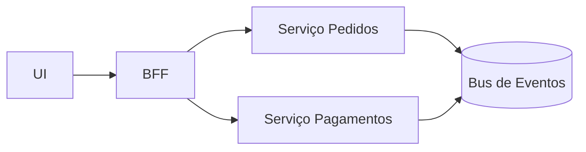

Análise de complexidade, custo operacional e autonomia de times.

Evolução incremental e estrangulamento de monólitos.

## Matriz de Decisão

- Domínio e Times: autonomia e limites claros favorecem microserviços.
- Complexidade Operacional: monitoração, deploy, versionamento e observabilidade aumentam com microsserviços.
- Latência e Consistência: comunicação remota, falhas parciais e consistência eventual exigem resiliência.
- Custos: infraestrutura, pipelines e governança podem crescer; monolito tem custo operacional menor.

## Padrões e Estratégias

- Strangler Fig: migrar módulos do monolito para serviços, roteando tráfego gradualmente.
- Event‑Driven: publicação de eventos de domínio; desacoplamento; replays.
- BFF e gateways: separar camadas por cliente; padronizar cross‑cutting em gateway (auth, rate limit, caching).

## Anti‑Padrões

- Base de dados compartilhada entre serviços.
- Orquestração rígida sem tolerância a falhas; acoplamento excessivo em contratos.
- Microserviços “nano” sem fronteira de domínio real.

## Exemplo

## Checklist

- Definir limites de contexto e agregados antes da divisão.
- Observabilidade (logs, métricas, tracing) e resiliência (retries, circuit breaker).
- Estratégias de dados: cada serviço dono do seu armazenamento; eventos para integração.

## Referências

- Microservices (M. Fowler): https://martinfowler.com/articles/microservices.html
- Reactive Systems: https://www.reactivefoundation.org/

