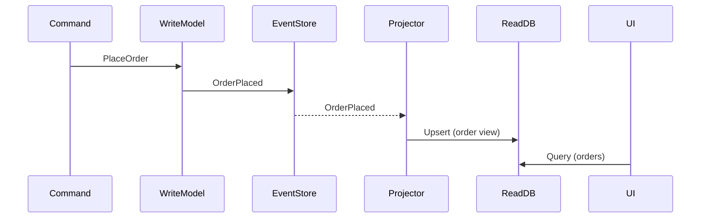

Consistência eventual e projeções.

Casos práticos e trade-offs.

## Arquitetura

- Write Model: comandos validam regras de negócio e persistem eventos.
- Event Store: registro imutável; replays para reconstrução e auditoria.
- Read Model: projeções materializadas para consultas rápidas.

## Padrões

- Idempotência em handlers; ordenação por versão; snapshots para reduzir replays.
- Resiliência: filas e reprocessamento; monitoramento de atrasos de projeção.

## Fluxo



## Exemplo (pseudo‑código)

```ts
type OrderPlaced = { id: string; items: Item[]; occurredAt: Date }
function handlePlaceOrder(cmd) { validate(cmd); appendEvent('OrderPlaced', cmd) }
function projector(event) { upsertView(event.id, computeView(event)) }
```

## Checklist

- Separar comandos/consultas; versionar eventos; documentar contratos.
- Projetores com tolerância a falhas; observabilidade de lag; backups do event store.

## Referências

- Event Sourcing (M. Fowler): https://martinfowler.com/eaaDev/EventSourcing.html
- Greg Young: https://cqrs.wordpress.com/

